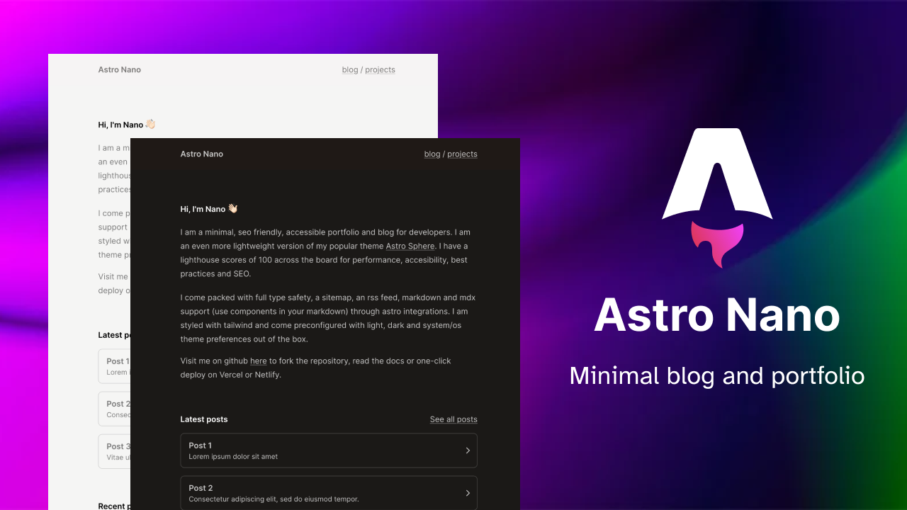

Astro Nano is a static, minimalist, lightweight, lightning fast portfolio and blog theme.

Built with Astro, Tailwind and Typescript, an no frameworks.

It was designed as an even more minimal theme than my popular theme [Astro Sphere](https://github.com/markhorn-dev/astro-sphere)

## 🚀 Deploy your own

  

## 📋 Features

- ✅ 100/100 Lighthouse performance
- ✅ Responsive
- ✅ Accessible
- ✅ SEO-friendly
- ✅ Typesafe
- ✅ Minimal style
- ✅ Light/Dark Theme
- ✅ Animated UI
- ✅ Tailwind styling
- ✅ Auto generated sitemap
- ✅ Auto generated RSS Feed
- ✅ Markdown support
- ✅ MDX Support (components in your markdown)

## 💯 Lighthouse score

## 🕊️ Lightweight
No frameworks or added bulk

## ⚡︎ Fast
Rendered in ~40ms on localhost

## 📄 Configuration

The blog posts on the demo serve as the documentation and configuration.

## 💻 Commands

All commands are run from the root of the project, from a terminal:

Replace npm with your package manager of choice. `npm`, `pnpm`, `yarn`, `bun`, etc

| Command                   | Action                                           |
| :------------------------ | :----------------------------------------------- |
| `npm install`             | Installs dependencies                            |
| `npm run dev`             | Start local dev server at `localhost:4321`       |
| `npm run build`           | Build your production site to `./dist/`          |
| `npm run preview`         | Preview your build locally before deploying      |

## 🐳 Docker Support

This portfolio site includes Docker support for easy deployment and consistent environments, optimized for performance.

### Docker Commands

| Command                                | Action                                           |
| :------------------------------------- | :----------------------------------------------- |
| `docker build -t portfolio-nginx .`    | Build the Nginx image                            |
| `docker run -p 8080:80 portfolio-nginx` | Run the Nginx container on port 8080             |
| `docker-compose up`                    | Build and run the container                      |
| `docker-compose up --build`            | Rebuild and run the container                    |
| `./benchmark-boot-time.sh`             | Measure the boot time of the Nginx container     |

### Optimized for Speed

The site is served using Nginx, an ultra-minimal Alpine-based server optimized for static content, providing an excellent balance of features and performance.

### GitHub Actions Workflow

The repository includes a GitHub Actions workflow that:

1. Builds the Docker image when you push to the main branch
2. Pushes the image to GitHub Container Registry
3. Deploys the image to your server (requires configuring SSH secrets)

### Required GitHub Secrets for Deployment

To enable automatic deployment, add these secrets to your GitHub repository:

- `SSH_HOST`: Your server's hostname or IP address
- `SSH_USERNAME`: SSH username for your server
- `SSH_PRIVATE_KEY`: SSH private key for authentication
| `npm run dev`             | Starts local dev server at `localhost:4321`      |
| `npm run dev:network`     | Starts local dev server on local network         |
| `npm run sync`            | Generates TypeScript types for all Astro modules.|
| `npm run build`           | Build your production site to `./dist/`          |
| `npm run preview`         | Preview your build locally, before deploying     |
| `npm run preview:network` | Preview build on local network                   |
| `npm run astro ...`       | Run CLI commands like `astro add`, `astro check` |
| `npm run astro -- --help` | Get help using the Astro CLI                     |
| `npm run lint`            | Run ESLint                                       |
| `npm run lint:fix`        | Auto-fix ESLint issues                           |

## 🏛️ License

MIT